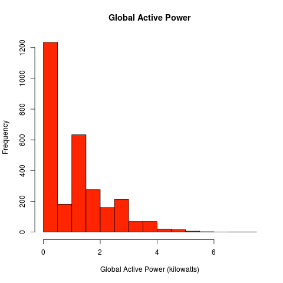
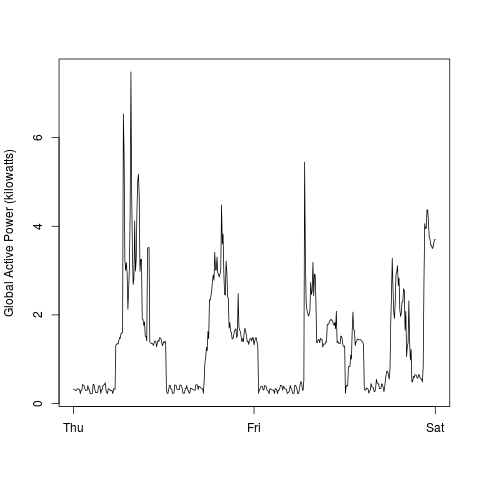
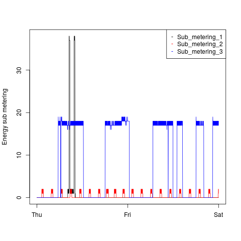
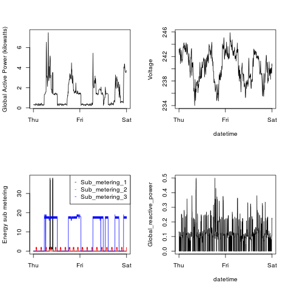

## Data

See src folder for R scripts & images.
Change the home directory in env.R to your home directory if you would like to execute scripts.

### Plot 1

 

### Plot 2

 

### Plot 3

 

### Plot 4

